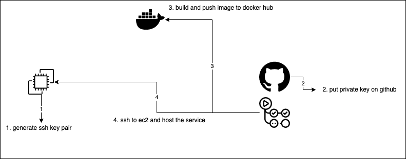

# Neko Sekai Website
[![AWS EC2][aws-ec2-shield]][aws-ec2-url]
[![Docker][docker-shield]][docker-url]
[![Nginx][nginx-shield]][nginx-url]
[![Cloudflare][cloudflare-shield]][cloudflare-url]
[![MIT License][license-shield]][license-url]
![Github][github-action-shield]
[![Build Status][github-action-status]][github-action-url]

- self-hosted website
- Project Link: https://www.nekosekai.com

## Automatic Deployment Process

- Realized by Github Actions and Docker Hub

## Built With
- DNS server with [Cloudflare][cloudflare-url]
- Realize HTTPS with Cloudflare [flexible SSL](https://developers.cloudflare.com/ssl/origin-configuration/ssl-modes/flexible/)
- Host on [AWS EC2][aws-ec2-url]
- Proxy server with [Nginx](https://www.nginx.com/)
- Run service with [Docker][docker-url]
- Auto deployment with Github Action

## Roadmap
- [x] Host On AWS 
- [x] Add SSL Connection
- [x] Add home page  
- [ ] Add Cats page
- [ ] Add Tech page
- [ ] Add Nihongo page
- [ ] Add About page
- [x] Add Github action for auto deployment
- [ ] Add image CDN

## License
MIT

## Contact
- Email: yusianglin11010@gmail.com

[license-shield]: https://img.shields.io/github/license/othneildrew/Best-README-Template.svg?style=for-the-badge
[license-url]: https://github.com/yusianglin11010/neko-sekai/LICENSE
[aws-ec2-shield]: https://img.shields.io/badge/awsEC2-FF9900?style=for-the-badge&logo=amazonec2&logoColor=white
[aws-ec2-url]: https://aws.amazon.com/ec2/
[docker-shield]: https://img.shields.io/badge/docker-2496ED?style=for-the-badge&logo=docker&logoColor=white
[docker-url]: https://www.docker.com/
[nginx-shield]: https://img.shields.io/badge/nginx-009639?style=for-the-badge&logo=nginx&logoColor=white
[nginx-url]: https://www.nginx.com/
[cloudflare-url]: https://www.cloudflare.com/zh-tw/
[cloudflare-shield]: https://img.shields.io/badge/cloudflare-F38020?style=for-the-badge&logo=cloudflare&logoColor=white
[github-action-shield]: https://img.shields.io/badge/githubactions-2088FF?style=for-the-badge&logo=githubactions&logoColor=white
[github-action-status]: https://github.com/yusianglin11010/neko-sekai/workflows/aws-ci-cd/badge.svg?branch=main
[github-action-url]: https://github.com/yusianglin11010/neko-sekai/actions?query=branch

